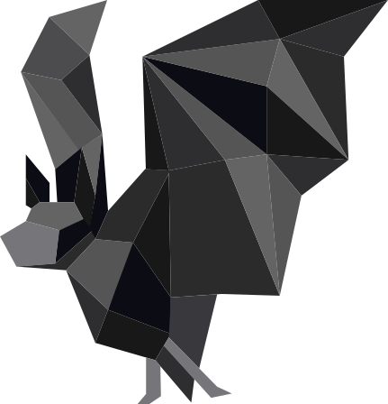

# s-elbat Project



## Overview

The `s-elbat` project is an entity linking tool designed to process and analyze tabular data using both supervised and unsupervised techniques. This repository includes various scripts and tools to facilitate data processing, model training, and evaluation.

## Features

### Supervised and Unsupervised Techniques

- **Supervised Semantic Table Interpretation:** Advanced features including context-based and similarity predictions, along with feature extraction revision.
- **Unsupervised Feature/Vector-based Entity Retrieval and Disambiguation:** Feature extraction, context-based prediction, and export functionalities.

## Configuration

The behavior of the s-elBat system can be configured using the `.env-template` file. You can set the mode of operation (supervised or unsupervised) by setting the `SUPERVISED` variable.

### Example `.env-template`

```
# Set to true for supervised mode, false for unsupervised mode
SUPERVISED=true
```

Rename `.env-template` to `.env` and adjust the settings as needed.

## Getting Started

To get started with this project, clone the repository and install the necessary dependencies.

```sh
git clone <repository-url>
cd s-elbat
cp .env-template .env
```

## Running the System

To run the s-elBat system using Docker Compose, use the following command:

```sh
docker-compose up
```

Ensure the environment is set up correctly by configuring the `SUPERVISED` variable in the `.env` file before running the command.


